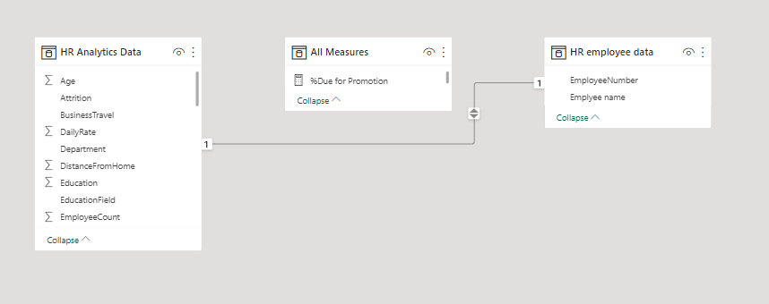
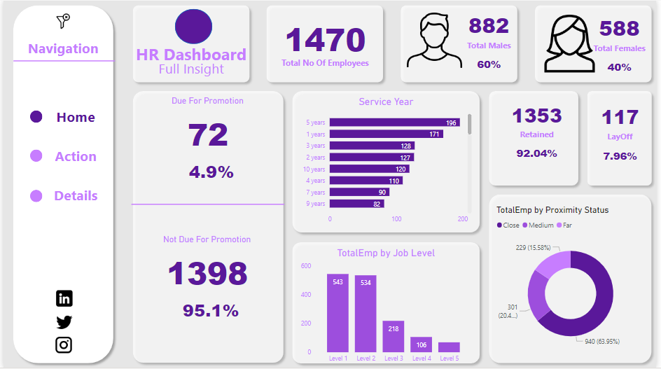

# Human Resources Data Analysis/Report

## Introduction
This is a power BI project on Human Resource Data Analysis of a HR Department in a fictitious company. The project is to analyze and derive insights to answer relevant questions and help the store make data driven decisions. 
**_Disclaimer_**: _All datasets and reports do no represent any company, institution or country, but just a dummy dataset to demonstrate capabilities of Power BI._

## Problem Statement
1.	Percentage of Male to Female employees present.
2.	Number of employees due to those not due for promotion Per Department.
3.	Number of employees due for retirement Per Department.
4.	Percentage of Employee job satisfaction per category.
5.	Employee living Distance from office  divided into categories.
6.	Number of employees due to those not due for promotion Per Job Roles
7.	Names of Employees due for promotion to those due for retirement within the company across departments and job Roles.

## Skills / Concepts Demonstrated
The following Power BI Features were incorporated:
- Bookmarking, 
- Dax, 
- Quick Measures, 
- Power Query(Conditional Columns,Merging Queries)
- Page Navigation, 
- Modeling, 
- Filters, 
- Tooltips, 
- Buttons

## Modelling
The relationships was Automatically  Created.

A One to One Bi-Directional relationship was created between the two tables.
_Although I noticed i did not find a use for the automatically createdrelationship._

## Visualization
The Report Comprises of 3 Pages:
1. Home
2. Action
3. Details

_**Note**: the clear all filter button is what sits above the power bi report navigation text on each report page._

## Some insights from the Analysis
- There are a total of 1470 employees, 882 of which are males and 588 are females.
- 72 out of all employees were due for promotion.
- 117 are expected to be laid off.
- Most employees live in close proximity with the office.
- Level one had the most employees by job level.
- Off all job roles, Manager had the most due for promotion and the most due for layoff.
- Sales Executive role had the most number of employees.

## You can view a live version of the report [here](https://app.powerbi.com/view?r=eyJrIjoiNGQ0ZDc0MTItYzdkZS00YTViLTlkZmYtYzQwY2JhMzI5YzAxIiwidCI6Ijk5ZGRhNWRkLTYzNDYtNDc3OC04OTVmLWNkNGNiNjBhNDQxNiJ9)

